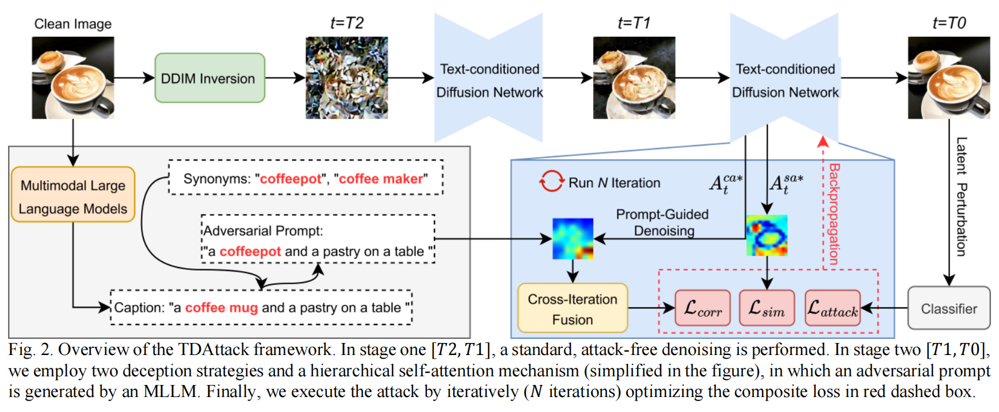
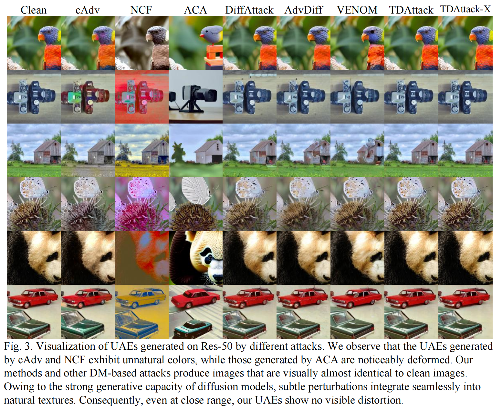
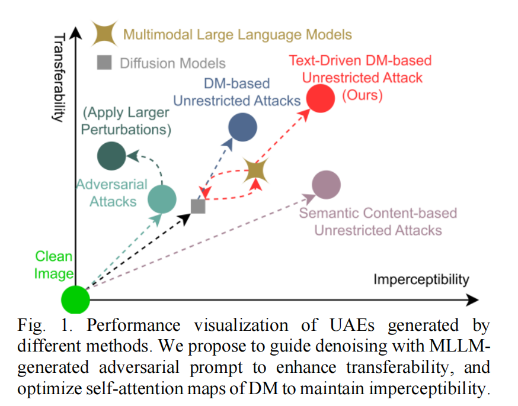
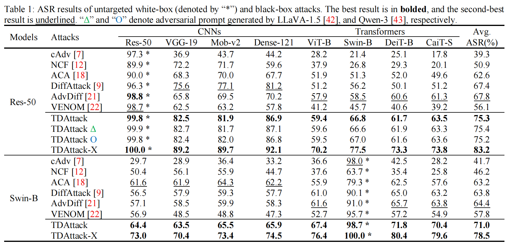
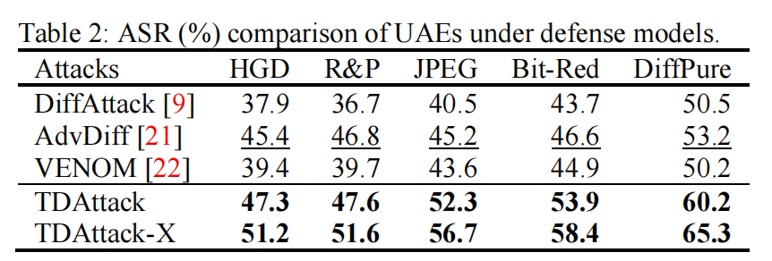
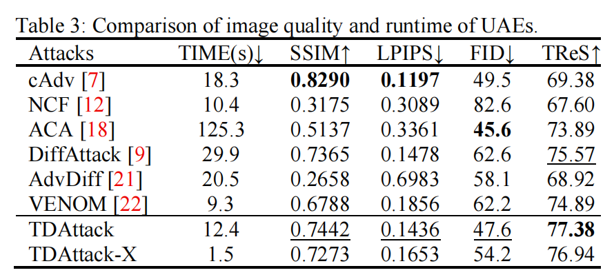

## TDAttack ICASSP 2026 
 
   The key  code repository for our paper TDAttack: Enhancing Transferability of Unrestricted Adversarial Examples via Text-Driven Diffusion.
## Overview

<div>
  
</div>

## Visualization

<div>
  
</div>

## Requirements

1. Hardware Requirements
    - GPU: 1x high-end NVIDIA GPU with at least 16GB memory
    - Memory: At least 40GB of storage memory

2. Software Requirements
    - Python: 3.10
    - CUDA: 12.2

   To install other requirements:

   ```
   adversarial_robustness_toolbox==1.13.1
   diffusers==0.30.3
   eagerpy==0.30.0
   natsort==8.2.0
   numpy==1.21.2
   opencv_python==4.5.4.58
   Pillow==9.2.0
   scipy==1.7.1
   timm==0.4.12
   tqdm==4.62.2
   pretrainedmodels==0.7.4
   ```
3. Datasets
   - Please download the dataset [ImageNet-Compatible](https://github.com/cleverhans-lab/cleverhans/tree/master/cleverhans_v3.1.0/examples/nips17_adversarial_competition/dataset) and then change the settings of `--images_root` and `--label_path` in [main.py](main.py)
   - Note: [data](data) is just a placeholder, you should download the dataset and put it here.

4. Stable Diffusion Model
   - We adopt [Stable Diffusion 2.1](https://huggingface.co/stabilityai/stable-diffusion-2-1-base) as our diffusion model, you can download and load the pretrained weight by setting `stabilityai/stable-diffusion-2-1-base"` in [load_diffusion.py](load_diffusion.py).
   - Note: [stabilityai/stable-diffusion-2-1-base](stabilityai/stable-diffusion-2-1-base) is just a placeholder, you should download the model and put it here.
   
5. Large Language Model
   - [BLIP-2](https://huggingface.co/Salesforce/blip2-opt-2.7b), [Qwen-3](https://huggingface.co/Qwen/Qwen3-Reranker-8B), [LLaVA-1.5](https://huggingface.co/liuhaotian/llava-v1.5-7b) are needed to generate adversarial prompts based on classification labels. Experiments have shown that different multimodal large language models achieve nearly equivalent performance. You can access [BLIP-2](https://huggingface.co/Salesforce/blip2-opt-2.7b), [Qwen-3](https://huggingface.co/Qwen/Qwen3-Reranker-8B), [LLaVA-1.5](https://huggingface.co/liuhaotian/llava-v1.5-7b) to process it yourself, or directly use the [adversarial_prompt.txt](adversarial_prompt.txt) we provide.

## Crafting Unrestricted Adversarial Examples 

   To craft unrestricted adversarial examples, run this command:
   
   ```
   python main.py --model_name <surrogate model> --save_dir <save path> --images_root <clean images' path> \\
    --label_path <clean images' label.txt> --error_prompt <error prompts' path> \\ 
    --num_diffusion_steps <total DDIM sampling steps> --T1 <end the early stage> \\ 
    --prompt_injection_steps <prompt switching>
   ```
   In order to change the interval ([$T2,T1$]; [$T1,T0$] in the paper), specify: `--T1` in [main.py](main.py)
   
   The specific surrogate models we support can be found in `model_selection` function in [other_attacks.py](other_attacks.py).

## Evaluation
   
   To evaluate the crafted unrestricted adversarial examples on other black-box models, run:
   
   ```
   python eval_asr.py
  ```
   To evaluate image quality metrics for crafted unrestricted adversarial examples, run:
   
   ```
   python eval_ref_quality.py
   
   python eval_no_ref_quality.py
   ```

## Results
<div>
  
</div>

<div>
  
</div>


<div>
  
</div>


<div>
  
</div>